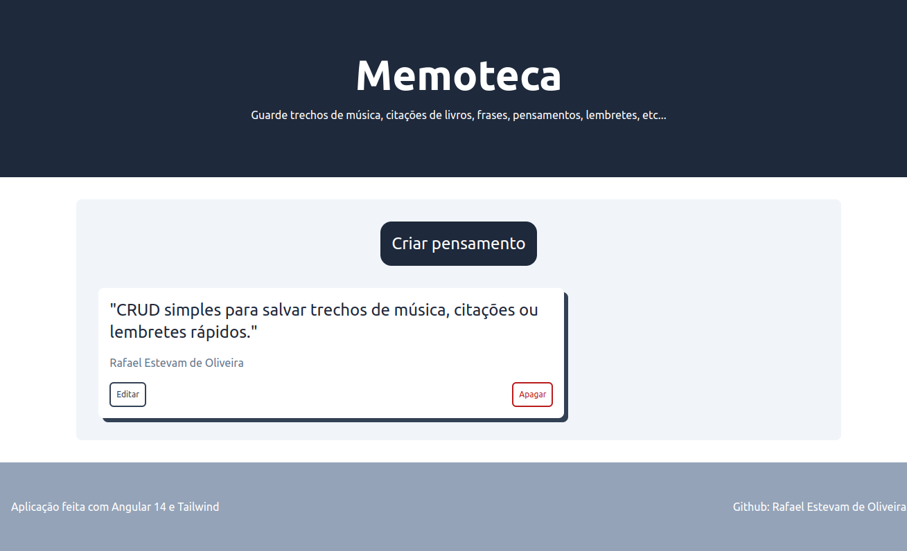
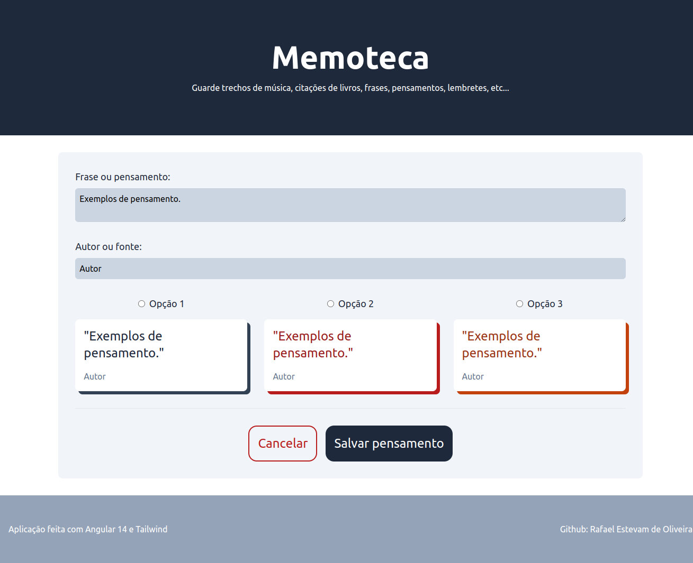

# Memoteca

CRUD de pensamentos feitos com .

Aplicação desenvolvida para estudos de tecnologias do frontend.

## Iniciando aplicação

Instalando dependências do frontend.

```
npm install
```

Iniciando o frontend.

```
npm start
```

O frontend será iniciado em http://localhost:4200

### Backend

Backend construído com JSON Server somente para simular uma integração através de API Rest. O backend encontra-se dentro de ./back.

Instalando dependências do backend.
```
npm install
```

Iniciando o backend.

```
npm start
```

O backend será iniciado em http://localhost:3000

## Resultado

### Tela inicial



### Tela de cadastro de pensamentos




